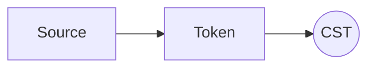

Fixture page. The CST is built from [[token|tokens]] scanned out of the [[source]].

## Why

One tree, read by every feature, means one parse per edit.

```mermaid
flowchart LR
  S[Source] --> T[Token] --> C((CST))
  click T "/atlas/token"
```

A link to nowhere: [[no-such-page]].
